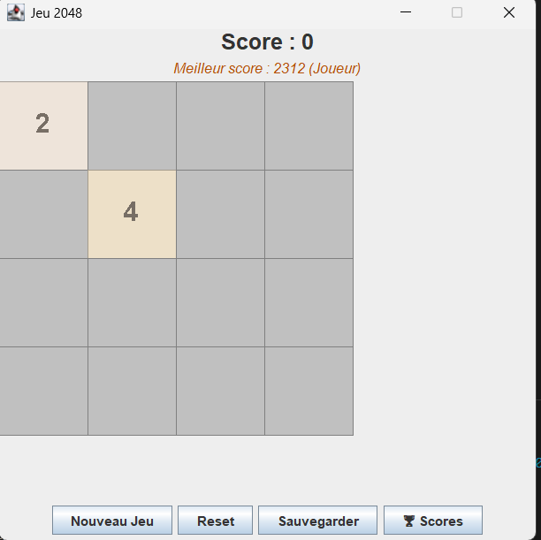

# Jeu 2048

## Description
Implementation of the 2048 game in Java.

## Features
- Move tiles
- Score tracking
- Best score saving
- Game over detection

## Technologies
- Java
- Swing
- Maven
- SQLite

## How to Run

```bash
mvn clean compile
mvn exec:java


## Screenshot


